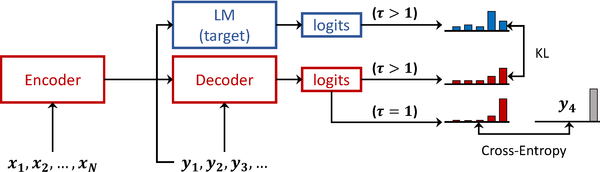

This repository contains source code for the paper 
"Language Model Prior for Low-Resource Neural Machine Translation" 
([Paper](https://arxiv.org/abs/2004.14928))


# Introduction 

<p align="center">
  
</p>

In this work, we use a  language model (LM) trained
on target-side monolingual corpora as a weakly
informative prior. We add a regularization term,
which drives the output distributions of the translation model (TM) to
be probable under the distributions of the LM.

# Prerequisites

 
### Install Requirements

**Create Environment (Optional)**: Ideally, you should create an environment 
for the project.

```
conda create -n lmprior python=3
conda activate lmprior
```

Install PyTorch `1.4` ([guide](https://pytorch.org/get-started/previous-versions/#v140)) 
with the desired Cuda version if you want to use the GPU:
```shell
# CUDA 10.1
pip install torch==1.4.0 torchvision==0.5.0
```
and then the rest of the requirements:
```
pip install -r requirements.txt
```

### Download Data

**1. Parallel data**: 
You can download the preprocessed data, the truecase models and the pretrained sentencepiece models from this link:
http://data.statmt.org/cbaziotis/projects/lm-prior/parallel. 
Put the `wmt_ende` and `wmt_entr` folders in the `datasets/mt/` directory. 

To prepare the data on your own: 
 1. run `datasets/mt/download_data.sh`
 2. run `datasets/mt/preprocess_parallel.sh`
 
 
**2. Monolingual data**: 
You can download the preprocessed data from this link:
http://data.statmt.org/cbaziotis/projects/lm-prior/mono and then put the files in 
the `datasets/mono/priors/` directory.


# Training

### Run Visdom server (required)
We use Visdom for visualizing the training progress. Therefore, first open a terminal and run the visdom server:
```shell script
> visdom
``` 

Once you start training a model, open the visdom dashboard in your browser 
(by default in `http://localhost:8097/`) and select a model to view its statistics,
or multiple models to compare them.

Read more about visdom here: https://github.com/facebookresearch/visdom#usage

### How to train a model
Every model requires a base configuration stored in a `.yaml` file. 
All model configurations are stored in the `configs/` directory. 
When you run an experiment you need to provide a base config 
and optionally override the parameters in the config file.

For example, you can train a LM on a small test corpus like this:
```shell script
/models$  python sent_lm.py --config ../configs/prototype.rnn_lm_en.yaml
```

To override one of the parameters in the config, you don't have to create a new one,
just pass the parameter-value pair like that:
```shell script
/models$  python sent_lm.py --config ../configs/prototype.rnn_lm_en.yaml  model.emb_size=256
```
For nested parameters, separate the names with `.`.

**Experiment output**: 
For every model that is trained, all its data, 
including the checkpoint, outputs and its training progress,
are saved in the `experiments/` directory, under `experiments/CONFIG_NAME/START_DATETIME`.
For instance, a model trained with the command above will be saved under:
`experiments/prototype.rnn_lm_en/20-10-21_16:03:22`.

Verify that the model is training by opening visdom and selecting the model from the search bar.

### 1. Train a language model (LM)
To train an LM you need to run  `models/sent_lm.py` using the desired config.
For example, to train an English Transformer-based LM on the 3M NewsCrawl data, 
same as in the paper, use the config `configs/transformer/prior.lm_news_en_trans.yaml`
and (optionally) pass any parameters to override those in the config file:

```shell
/models$ python sent_lm.py --config ../configs/transformer/prior.lm_news_en_trans.yaml  \
  --device cuda  --name prior.lm_news_en_3M_trans_big \ 
  batch_tokens=12000 model.emb_size=1024 model.nhid=4096 model.nhead=16 model.dropout=0.3
```
If you open `configs/transformer/prior.lm_news_en_trans.yaml` you will see that it expects a preprocessed dataset:
```shell
  ...

   data:
     train_path: ../datasets/mono/priors/news.en.2014-2017.pp.3M.train
     val_path:   ../datasets/mono/priors/news.en.2014-2017.pp.val
     subword_path: ../datasets/mt/wmt_ende/en.16000

  ...
```
You can change the path to your own _preprocessed_ dataset 
or [download](http://data.statmt.org/cbaziotis/projects/lm-prior/) t
he prepared data we used in the paper.

**Reproducibility**: You can find the exact commands 
that were used for training the LMs used in the paper
in `configs/transformer/experiments_priors.sh`.


**Sanity check**
Verify that the model is training correctly by looking at the loss and model outputs (samples) in visdom.
You can test that everything is working correctly by trying first with a small model.
You should start to see reasonable sentences after a while.

### 2. Train a translation model (TM)

To train a TM you need to run  `models/nmt_prior.py` using the desired config.
For the Transformer-based experiments, check the config files in `configs/transformer/`.


#### Train a standard TM

To train a standard TM for `de->en` with a transformer architecture run:
```shell
/models$  nmt_prior.py --config ../../configs/transformer/trans.deen_base.yaml --name final.trans.deen_base
```
All the model outputs will be saved in `experiments/trans.deen_base/START_DATETIME/`,
including the checkpoint of the model that has achieved the best score in the dev set.


#### Train a TM with a LM-prior

To train a standard TM for `de->en` with a transformer architecture run:
```shell
/models$  nmt_prior.py --config ../../configs/transformer/trans.deen_prior.yaml --name final.trans.deen_base
```
If you open `configs/transformer/trans.deen_prior.yaml` you will see that it expects a pretrained LM
```shell
  ...

  # path to pretrained LM. It is required for LM-Fusion and LM-priors
  prior_path: ../checkpoints/prior.lm_news_en_3M_trans_best.pt

  ...
```
You can change the path to your pretrained LM or download on the pretrained LMs we used in the paper from:
http://data.statmt.org/cbaziotis/projects/lm-prior/checkpoints/.


#### Reproducibility
In the following files, you will find all the commands for
reproducing the experiments in the paper:

 - `configs/transformer/experiments_nmt.sh` contains the commands for the main NMT experiments.
 - `configs/transformer/experiments_nmt_subsample_deen.sh` contains the commands 
   for the NMT experiments on various scales of the `en->de` parallel data.
 - `configs/transformer/experiments_sensitivity.sh` contains the commands 
   for the sensitivity analysis.


# Evaluation

To evaluate a pretrained translation model you need to use `models/translate.py`.
```
$ python models/translate.py --help

usage: translate.py [-h] [--src SRC] [--out OUT] [--cp CP] [--ref REF]
                    [--beam_size BEAM_SIZE] [--length_penalty LENGTH_PENALTY]
                    [--lm LM] [--fusion FUSION] [--fusion_a FUSION_A]
                    [--batch_tokens BATCH_TOKENS] [--device DEVICE]

optional arguments:
  -h, --help            show this help message and exit
  --src SRC             Preprocessed input file, in source language.
  --out OUT             The name of the *detokenized* output file, in the
                        target language.
  --cp CP               The checkpoint of the translation model.
  
  --ref REF             (optional) The raw reference file, 
                        to internally compute BLEU by calling sacreBLEU.
                        
  --beam_size BEAM_SIZE 
                        The width of the beam search (default=1)
  
  --length_penalty LENGTH_PENALTY
                        The value of the length penalty (default=1.0)
                        
  --lm LM               The checkpoint of a pretrained language
                        model.Applicable when using LM fusion.
  --fusion FUSION       The type of LM-fusion to use. 
                        Options: [shallow, postnorm, prenorm]
  --fusion_a FUSION_A   This is the weight for the LM in shallow-fusion.
  --batch_tokens BATCH_TOKENS
                        The size of the batch in number of tokens.
  --device DEVICE       The devide id to use (e.g., cuda, cuda:2, cpu, ...)
```

**Important**: When using POSTNORM, in test time you should use the _same_ 
LM checkpoint that you used during training the TM.


To evaluate a pretrained translation model, run:
```shell
# translate the preprocessed input file (DE)
python models/translate.py --src datasets/mt/wmt_ende/test.de.pp \ 
  --out test.en.pp.hyps \
  --cp experiments/trans.deen_base/START_DATETIME/trans.deen_base_best.pt \ 
  --beam_size 5 --device cuda

# compare the raw detokenized hypothesis file (EN'), with the raw test set (EN)
cat test.en.pp.hyps | sacrebleu datasets/mt/wmt_ende/test.en
> BLEU+case.mixed+numrefs.1+smooth.exp+tok.13a+version.1.4.14 = 25.4 59.8/32.9/20.1/12.6 (BP = 0.954 ratio = 0.955 hyp_len = 64022 ref_len = 67012)
```
> This is the same way you evaluate a TM that was trained with a LM-prior, as the LM is not needed in test time.

To evaluate a pretrained translation model with shallow-fusion 
and with a weight of `λ=0.1`, run:
```shell
# translate the preprocessed input file (DE)
python models/translate.py --src datasets/mt/wmt_ende/test.de.pp \ 
  --out test.en.pp.hyps \
  --cp experiments/trans.deen_base/START_DATETIME/trans.deen_base_best.pt \ 
  --lm checkpoints/prior.lm_en.pt  --fusion shallow  --fusion_a 0.1 \
  --beam_size 5 --device cuda

# compare the raw detokenized hypothesis file (EN'), with the raw test set (EN)
$ cat test.en.pp.hyps | sacrebleu datasets/mt/wmt_ende/test.en
BLEU+case.mixed+numrefs.1+smooth.exp+tok.13a+version.1.4.14 = 26.1 60.0/33.4/20.7/13.2 (BP = 0.962 ratio = 0.962 hyp_len = 64484 ref_len = 67012)
```


## Analysis

To view more information about the analysis done in the paper go to: 
http://data.statmt.org/cbaziotis/projects/lm-prior/analysis


# Reference
```
@inproceedings{baziotis-etal-2020-language,
    title = "Language Model Prior for Low-Resource Neural Machine Translation",
    author = "Baziotis, Christos  and
      Haddow, Barry  and
      Birch, Alexandra",
    booktitle = "Proceedings of the Conference on Empirical Methods in Natural Language Processing (EMNLP)",
    month = nov,
    year = "2020",
    address = "Online",
    publisher = "Association for Computational Linguistics",
    url = "https://www.aclweb.org/anthology/2020.emnlp-main.615",
    doi = "10.18653/v1/2020.emnlp-main.615",
    pages = "7622--7634"
}
```